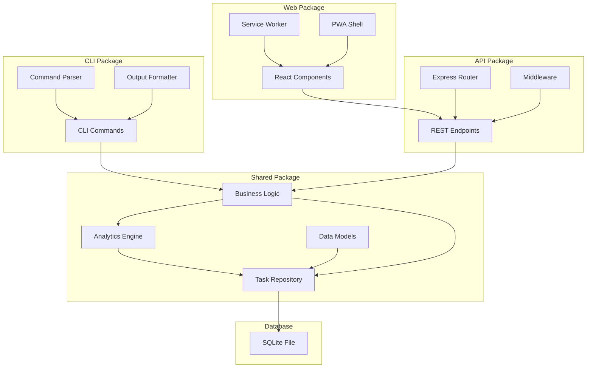

# Components

## CLI Package (packages/cli)

**Responsibility:** Primary user interface providing full feature parity with sub-1 second response times, direct SQLite access for optimal performance.

**Key Interfaces:**
- Command parsing and validation using Commander.js
- Direct database operations through shared repository layer
- Formatted output with celebration-focused messaging
- Export/import functionality for data portability

**Dependencies:**
- packages/shared (business logic, data models, repositories)
- better-sqlite3 (direct database access)
- commander.js (CLI framework)

**Technology Stack:** TypeScript, Node.js, Commander.js, direct SQLite access for performance

## Web API Package (packages/api)

**Responsibility:** REST API server providing identical functionality to CLI for web interface, maintaining feature parity through shared business logic.

**Key Interfaces:**
- RESTful endpoints matching CLI commands exactly
- JSON request/response handling with proper error codes
- CORS configuration for local development and production
- API documentation generation from TypeScript interfaces

**Dependencies:**
- packages/shared (identical business logic as CLI)
- Express.js (web framework)
- CORS middleware for cross-origin requests

**Technology Stack:** TypeScript, Node.js, Express.js, shared repository pattern

## Web Interface Package (packages/web)

**Responsibility:** React-based visual companion to CLI, providing responsive design and offline-first PWA capabilities with celebration-focused UI.

**Key Interfaces:**
- Component library for task management and analytics display
- Service worker for offline functionality
- Progressive Web App manifest and installation prompts
- Responsive design supporting desktop, tablet, mobile

**Dependencies:**
- packages/api (REST endpoints)
- React ecosystem (React, React Router)
- Tailwind CSS (utility-first styling)

**Technology Stack:** TypeScript, React, Vite, Tailwind CSS, PWA APIs

## Shared Package (packages/shared)

**Responsibility:** Core business logic, data models, and repository patterns shared between CLI and web to ensure behavioral consistency.

**Key Interfaces:**
- Repository interfaces for data access abstraction
- Business logic for task management, analytics, time calculations
- TypeScript type definitions and interfaces
- Validation schemas and utility functions

**Dependencies:**
- better-sqlite3 (database operations)
- UUID library (ID generation)
- Date manipulation utilities

**Technology Stack:** TypeScript, better-sqlite3, validation libraries

## Component Diagrams

