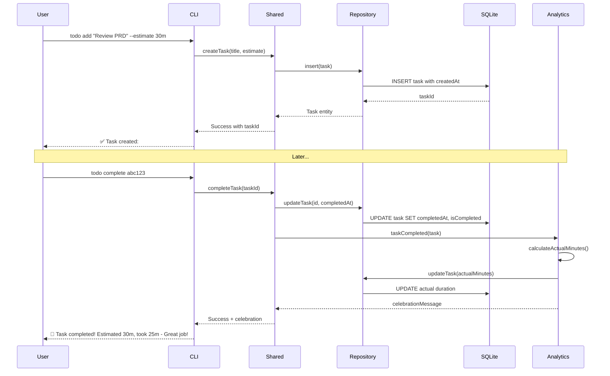
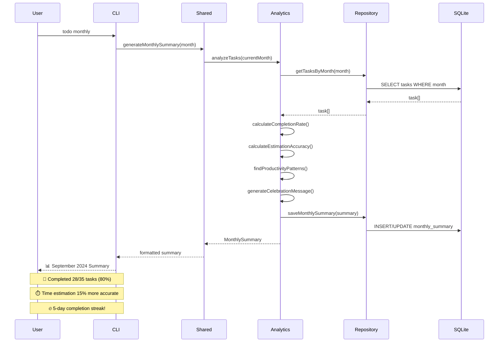

# Core Workflows

## Task Creation and Completion Workflow

```mermaid
sequenceDiagram
    participant User
    participant CLI
    participant Shared
    participant Repository
    participant SQLite
    participant Analytics

    User->>CLI: todo add "Review PRD" --estimate 30m
    CLI->>Shared: createTask(title, estimate)
    Shared->>Repository: insert(task)
    Repository->>SQLite: INSERT task with createdAt
    SQLite-->>Repository: taskId
    Repository-->>Shared: Task entity
    Shared-->>CLI: Success with taskId
    CLI-->>User: ✅ Task created: #abc123

    Note over User,Analytics: Later...

    User->>CLI: todo complete abc123
    CLI->>Shared: completeTask(taskId)
    Shared->>Repository: updateTask(id, completedAt)
    Repository->>SQLite: UPDATE task SET completedAt, isCompleted
    Shared->>Analytics: taskCompleted(task)
    Analytics->>Analytics: calculateActualMinutes()
    Analytics->>Repository: updateTask(actualMinutes)
    Repository->>SQLite: UPDATE actual duration
    Analytics-->>Shared: celebrationMessage
    Shared-->>CLI: Success + celebration
    CLI-->>User: 🎉 Task completed! Estimated 30m, took 25m - Great job!
```

## Monthly Summary Generation Workflow

```mermaid
sequenceDiagram
    participant User
    participant CLI
    participant Shared
    participant Analytics
    participant Repository
    participant SQLite

    User->>CLI: todo monthly
    CLI->>Shared: generateMonthlySummary(month)
    Shared->>Analytics: analyzeTasks(currentMonth)
    Analytics->>Repository: getTasksByMonth(month)
    Repository->>SQLite: SELECT tasks WHERE month
    SQLite-->>Repository: task[]
    Repository-->>Analytics: task[]

    Analytics->>Analytics: calculateCompletionRate()
    Analytics->>Analytics: calculateEstimationAccuracy()
    Analytics->>Analytics: findProductivityPatterns()
    Analytics->>Analytics: generateCelebrationMessage()

    Analytics->>Repository: saveMonthlySummary(summary)
    Repository->>SQLite: INSERT/UPDATE monthly_summary
    Analytics-->>Shared: MonthlySummary
    Shared-->>CLI: formatted summary
    CLI-->>User: 📊 September 2024 Summary
    Note over CLI,User: 🎉 Completed 28/35 tasks (80%)
    Note over CLI,User: ⏱️ Time estimation 15% more accurate
    Note over CLI,User: 🔥 5-day completion streak!
```
