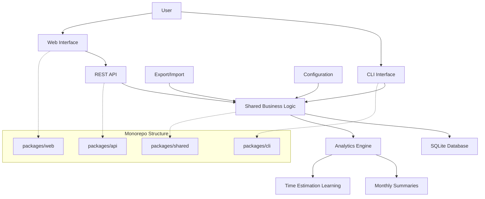

# High Level Architecture

## Technical Summary

The Intelligent Todo Application employs a **monolithic monorepo architecture** with CLI-first design principles, leveraging TypeScript across all components for type safety and code sharing. The system centers around a shared business logic core that powers both CLI and web interfaces, with SQLite providing simple local data persistence and celebration-focused analytics generation. The architecture prioritizes intelligent simplicity through deliberate constraint, avoiding complexity while delivering meaningful productivity insights through minimal behavioral data capture (task timestamps only).

## High Level Overview

**Architectural Style:** Monolithic Application within Monorepo Structure
- **Primary Pattern:** CLI-first with web companion, sharing common business logic
- **Repository Structure:** Monorepo with packages for CLI, web, and shared components
- **Service Architecture:** Single Node.js/Express backend serving REST API, with CLI direct database access
- **Data Flow:** User → CLI/Web → Shared Business Logic → SQLite → Analytics Engine → Celebration Reports

**Key Architectural Decisions:**
1. **CLI Primary, Web Secondary:** CLI provides full functionality with sub-1 second responses; web interface offers visual alternative
2. **Shared Business Logic:** TypeScript modules shared between CLI and web ensure consistent behavior
3. **Local-First Data:** SQLite eliminates server dependencies while supporting future PostgreSQL migration
4. **Celebration Analytics:** Monthly summary generation focuses on achievement over performance tracking
5. **Zero Authentication MVP:** Single-user local storage reduces complexity and security surface

## High Level Project Diagram

## Architectural and Design Patterns

**Core Patterns Selected:**

- **Repository Pattern:** Abstract data access for SQLite with future PostgreSQL migration support - *Rationale:* Enables testing isolation and database technology flexibility while maintaining simple interface

- **Shared Kernel Pattern:** Common TypeScript business logic shared between CLI and web packages - *Rationale:* Ensures behavioral consistency and reduces duplication while supporting CLI-first development approach

- **Command Pattern:** CLI command structure with consistent parsing and execution flow - *Rationale:* Provides extensible command system and clear separation between interface and business logic

- **Strategy Pattern:** Multiple export formats (JSON, CSV, Markdown) with common interface - *Rationale:* Supports user data ownership requirements while maintaining clean extensible design

- **Observer Pattern:** Analytics engine generates insights from task lifecycle events - *Rationale:* Decouples celebration report generation from core task operations, supporting BMAD simplicity principles
